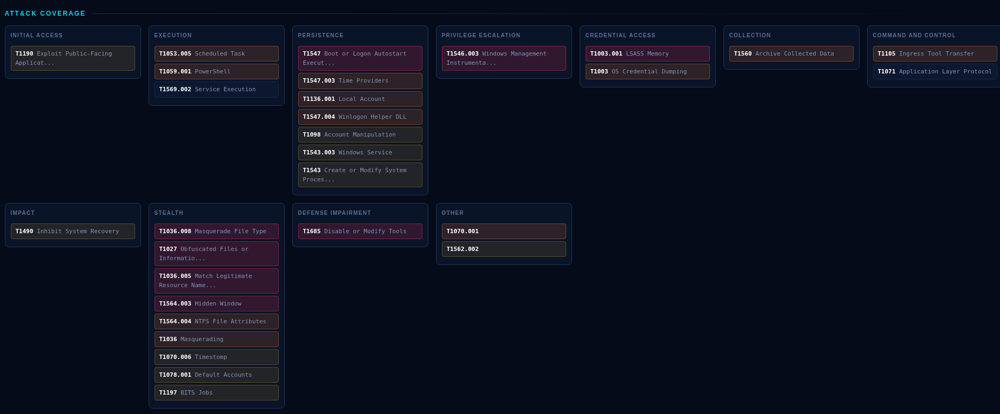

# Douglas-042


PowerShell - Windows incident response and threat hunting collector.
No external modules required. Works on PowerShell 5.1+ and PowerShell 7.

```powershell
Set-ExecutionPolicy -Scope Process Bypass -Force
.\Douglas-042.ps1
```

That's it — a menu opens. Run as **Administrator**.

Example report: [docs/REPORT-example.html](docs/REPORT-example.html)


---

## Two scripts in this repo

| Script | Question it answers | Time |
|---|---|---|
| [`Douglas-042.ps1`](Douglas-042.ps1) | *Is this machine compromised?* — 151 detection rules, risk score, HTML report | 1–15 min |
| [`Douglas-042-Lite.ps1`](Douglas-042-Lite.ps1) | *What is on this machine?* — single text snapshot, no analysis | under 1 min |

Start with Lite when you need eyes on a host immediately. Move to Douglas-042
when you need an answer you can put in a report. Lite documentation:
[docs/LITE.md](docs/LITE.md).

## What it does

Collects volatile and forensic artifacts from a live Windows host, evaluates them
against 151 built-in detection rules, and produces a single-file offline HTML report.

- **Collection** — process tree, network connections joined to owning process,
  services, scheduled tasks, autoruns (all ASEP locations), WMI persistence,
  drivers, event logs, Sysmon telemetry, file system, webshell hunt
- **Forensic parsers** — Prefetch (incl. Win8+ MAM decompression: run count,
  last 8 run times, loaded files), ShimCache, Amcache
- **Hunting** — baseline diff, rarity scoring, jitter-based beaconing detection,
  entity correlation
- **Optional** — Sigma rule matching, YARA scanning

Domain role is detected automatically (Client / Member Server / Domain
Controller) and the relevant modules are enabled — Kerberos event analysis only
runs on a DC, for example.

## Menu

```
   Sigma: ready   YARA: ready   MITRE: ready

  -- COLLECTION MODES --
   [1] Standard collection   Phase 0-3, last 14 days
   [2] Quick triage          skips Phase 3 (~1-2 min)
   [3] Wide scope + raw      30 days + VSS artifacts
   [4] Sigma-assisted        Sigma rule matching
   [5] Remote sweep          WinRM fan-out

  -- TOOLS --
   [6] Advanced / custom   [7] Usage guide   [8] Rule catalog
   [9] Update center
```

Parameters work too (`-Help` for the full list). The menu only opens when run
interactively with no parameters, so automation is unaffected.

## Usage

```powershell
# Standard collection, last 14 days
.\Douglas-042.ps1

# First response — skips file scanning and hashing
.\Douglas-042.ps1 -Quick

# Deep dive — 30 days, plus raw artifacts (MFT, hives, evtx, SRUM, Amcache) via VSS
.\Douglas-042.ps1 -Days 30 -CollectRaw

# Isolated or OPSEC-sensitive environment — no reverse DNS, no outbound lookups
.\Douglas-042.ps1 -NoResolve

# Match everything collected against your own indicators (one per line:
# hash / IP / domain / filename)
.\Douglas-042.ps1 -IocFile .\iocs.txt

# Compare against a known-good host and score rare artifacts
.\Douglas-042.ps1 -Baseline .\Output\DOUGLAS_GOLDEN_20260101_120000

# Sweep a fleet over WinRM — nothing is collected locally
.\Douglas-042.ps1 -ComputerName SRV01,SRV02,WKS17 -Credential (Get-Credential)

# Sigma matching against a compiled pack
.\Douglas-042.ps1 -SigmaPath .\sigma-pack.json

# Export the rule catalog to CSV (no admin, no collection)
.\Douglas-042.ps1 -ExportRuleCatalog
```

Report language is English by default; `-Language TR` renders the report in
Turkish. Collection logic is identical either way.

## Output

```
Output\DOUGLAS_<host>_<time>\
  REPORT.html      <- open this first (single file, offline)
  FINDINGS.csv     <- full evidence list
  TIMELINE.csv  MANIFEST.json  DELTA.csv  RARITY.csv  SIGMA.csv
  artifacts\  events\  logs\
```

The report shows unique findings; the complete evidence list is in FINDINGS.csv.
The HTML report is a single self-contained file with no external references —
it opens on an air-gapped machine and survives being emailed.

## Updating rule sets

This repo ships no third-party rules. Menu **[9] Update center** downloads current
versions into a `data\` folder next to the script:

| Source | What | Why this one |
|---|---|---|
| [SigmaHQ/sigma](https://github.com/SigmaHQ/sigma) | Sigma rules | The only official upstream; downloaded YAML is auto-compiled |
| [YARA-Forge](https://github.com/YARAHQ/yara-forge) | YARA rules (core) | Merges and deduplicates dozens of sources with a quality filter |
| [attack-stix-data](https://github.com/mitre-attack/attack-stix-data) | MITRE ATT&CK | MITRE's own official STIX release |
| [VirusTotal/yara](https://github.com/VirusTotal/yara) | yara64.exe | Engine required for YARA scanning |

Files are found in `data\`, next to the script, or in the working directory —
no paths to configure. **Nothing needs downloading to work offline**; all
collection and the 151 built-in rules run regardless.

`Build-SigmaPack.ps1` compiles Sigma YAML into the `sigma-pack.json` the collector
reads. Compilation happens once, ahead of time, so the collector itself never
needs a YAML parser.

## Design notes

**Sigma findings are excluded from the risk score.** Community rules vary in
quality and are presented separately as leads requiring verification. Most Sigma
rules assume a Sysmon/EDR field schema — rules relying on fields Douglas does not
collect are reported as "outside field coverage" rather than silently producing
wrong answers.

**Missing components are never silently skipped.** Without the YARA engine the
report states "scan not performed, component missing" (DGL-410). An analyst
believing a scan ran when it did not is the most dangerous failure mode.

**The risk score saturates.** Findings are counted unique, not raw, and weighted
on a curve that caps at 100. A machine with forty variations of the same
misconfiguration does not outrank a machine with one confirmed implant.

**Related findings are correlated into entities.** Six separate hits on the same
file, service, task or IP are presented as one chain rather than six disconnected
rows.

**The rule catalog lives in the code.** It is exported to CSV on request, and
every rule fired during a run is checked back against the catalog — documentation
that drifts from behaviour is caught by the script itself, not by a reader.

**PowerShell has no YARA engine.** VirusTotal's official binary is used — a
deliberate, optional exception to the zero-dependency rule.

## Things to know

- **Administrator rights are required.**
- **Live-system impact:** running this touches file access times and Prefetch.
  Image the disk first if forensic soundness is critical.
- **ShimCache is not execution evidence** — it shows a file was *seen* by the
  system. This is a common misreading.
- Long commands truncated in the report are marked `...[+N chars]`.
- PowerShell 4.0 runs in a reduced fallback mode for Server 2012 R2; some modules
  collect less. The report says so when this happens.

## License

MIT. Third-party rule sets carry their own licenses — see LICENSE.
