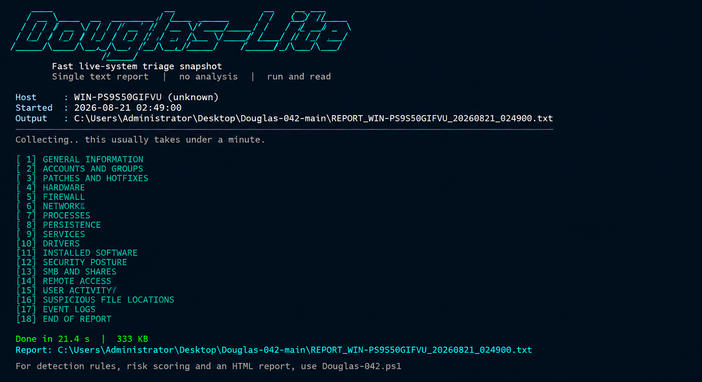

# Douglas-042 Lite

Fast live-system triage snapshot for Windows.

One pass, one plain-text file, under a minute. No parameters, no analysis, no
score — just a readable picture of what the machine looks like right now.

```powershell
Set-ExecutionPolicy -Scope Process Bypass -Force
.\Douglas-042-Lite.ps1
```

Run as **Administrator**. Output lands next to the script:

```
REPORT_<hostname>_<timestamp>.txt
```

That is the entire interface. There are no switches to learn and nothing to
configure.



## What it is for

You are on a host and you need to see it *now* — before deciding whether it
deserves a real investigation. Lite answers **"what is on this machine?"**

It does not tell you whether anything is wrong. It has no detection rules and
makes no judgements. You read it; you decide. If you want the machine evaluated
against rules with an evidence trail behind it, run
[Douglas-042](../README.md) instead.

| | Lite | Douglas-042 |
|---|---|---|
| Output | one `.txt` | folder: HTML report + CSV/JSON evidence |
| Detection rules | none | 153, plus optional Sigma and YARA |
| Risk score | none | 0–100, normalised |
| Forensic parsers | none | Prefetch, ShimCache, Amcache |
| MITRE ATT&CK mapping | none | yes |
| Remote collection | none | WinRM fan-out |
| Parameters | none | 20+ |
| Runtime | seconds | 1–15 minutes |

## What it collects

83 collection blocks across 17 sections:

| Section | Contents |
|---|---|
| General information | systeminfo, OS build, install and boot time, time zone, GPO result, BitLocker status |
| Accounts and groups | local users, enabled accounts, groups, Administrators membership, password policy, active sessions |
| Patches and hotfixes | installed hotfixes, release ID |
| Hardware | BIOS, processor, computer system, logical disks |
| Firewall | profiles, active configuration, enabled inbound rules |
| Network | IP configuration, adapters, routes, DNS servers, TCP connections joined to owning process, listening ports, UDP endpoints, ARP cache, hosts file (with timestamps), DNS client cache, proxy settings, netsh portproxy rules, mapped drives |
| Processes | full list with command line and owner, processes running from user-writable paths, top CPU and memory, instance counts |
| Persistence | startup commands, Run and RunOnce (HKLM and HKCU), startup folders, enabled scheduled tasks, WMI filters, consumers and bindings |
| Services | binary paths, running services, unquoted paths containing spaces |
| Drivers | loaded drivers |
| Installed software | uninstall registry keys |
| Security posture | Defender status, exclusions (both API and registry), threat history, audit policy, shadow copies |
| SMB and shares | shares, permissions, sessions, open files, client connections |
| Remote access | RDP status and sessions, per-user RDP connection history, PowerShell session configurations, WinRM listeners |
| User activity | USB device history, PSReadLine console history for all users, Kerberos sessions, recently modified files in profiles, Prefetch entries |
| Suspicious file locations | executables written to user-writable paths in the last 14 days, named pipes |
| Event logs | available logs, last 40 entries from Security / System / Application, new service installs (7045), log clearing (System 104, Security 1102) |

Everything comes from built-in Windows commands and CIM classes. Nothing is
downloaded, nothing is installed, no module is imported.

## Design notes

**Failures are written into the report, not swallowed.** When a collection block
fails, the report says `[collection failed] <reason>` in its place. An empty
section and a section that never ran look completely different — an analyst must
never mistake one for the other.

**Language-independent collection.** Host identity comes from `Get-NetIPAddress`
rather than parsing `ipconfig` output, which breaks on localised Windows
installations. Where a text-parsing fallback exists, it is a fallback only.

**Ordered for reading, not for machines.** The report is meant to be scrolled by
a human under time pressure, so sections run from broad context toward specific
suspicion. There is no CSV, no JSON and no schema, because parsing was never the
point — Douglas-042 exists for that.

## Things to know

- **Administrator rights are required.** Without them the script exits rather
  than collecting a partial picture.
- **Live-system impact:** running this touches file access times and Prefetch.
  If forensic soundness matters, image the disk first.
- The report typically runs a few hundred KB. `Ctrl+F` is your friend — start
  with the PROCESSES, PERSISTENCE and NETWORK sections.
- Prefetch entries are listed, not parsed. Run counts and execution timestamps
  require Douglas-042.

## License

Apache License 2.0 — see [../LICENSE](../LICENSE).
